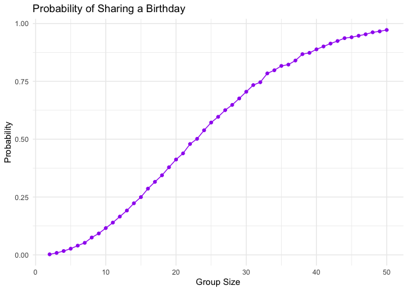
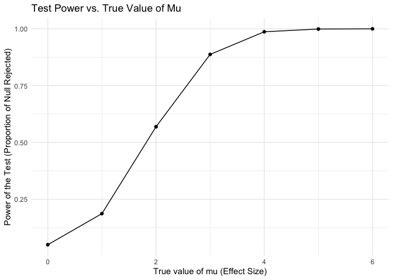
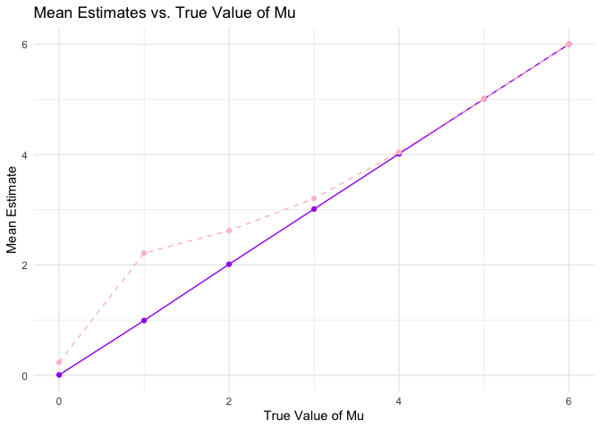
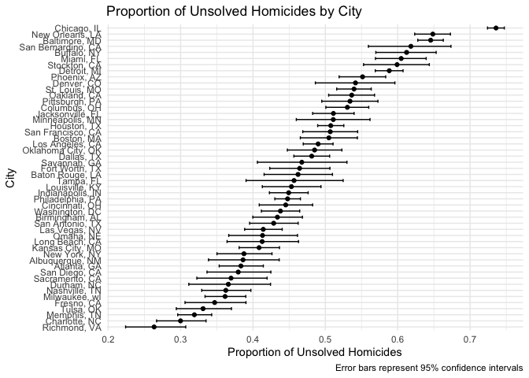

p8105_hw5_aw3621
================
Anni Wang
2024-11-14

load package for hw5

``` r
library(tidyverse)
```

    ## ── Attaching core tidyverse packages ──────────────────────── tidyverse 2.0.0 ──
    ## ✔ dplyr     1.1.4     ✔ readr     2.1.5
    ## ✔ forcats   1.0.0     ✔ stringr   1.5.1
    ## ✔ ggplot2   3.5.1     ✔ tibble    3.2.1
    ## ✔ lubridate 1.9.3     ✔ tidyr     1.3.1
    ## ✔ purrr     1.0.2     
    ## ── Conflicts ────────────────────────────────────────── tidyverse_conflicts() ──
    ## ✖ dplyr::filter() masks stats::filter()
    ## ✖ dplyr::lag()    masks stats::lag()
    ## ℹ Use the conflicted package (<http://conflicted.r-lib.org/>) to force all conflicts to become errors

``` r
library(rvest)
```

    ## 
    ## Attaching package: 'rvest'
    ## 
    ## The following object is masked from 'package:readr':
    ## 
    ##     guess_encoding

``` r
library(broom)
library(knitr)
library(ggplot2)
library(dplyr)
set.seed(1)

#data import for q3
 homicide_df =  
   read_csv("data/homicide-data.csv", na = c("NA",".","")) |> 
   janitor::clean_names()
```

    ## Rows: 52179 Columns: 12
    ## ── Column specification ────────────────────────────────────────────────────────
    ## Delimiter: ","
    ## chr (9): uid, victim_last, victim_first, victim_race, victim_age, victim_sex...
    ## dbl (3): reported_date, lat, lon
    ## 
    ## ℹ Use `spec()` to retrieve the full column specification for this data.
    ## ℹ Specify the column types or set `show_col_types = FALSE` to quiet this message.

\##Problem 1

``` r
###Write a function that, for a fixed group size, randomly draws “birthdays” for each person; checks whether there are duplicate birthdays in the group; and returns TRUE or FALSE based on the result.
birthday_sim <- function(n) {
  birthdays <- sample(1:365, n, replace = TRUE)  
  any(duplicated(birthdays))  
}

###run this function 10000 times for each group size between 2 and 50. For each group size, compute the probability that at least two people in the group will share a birthday by averaging across the 10000 simulation runs. Make a plot showing the probability as a function of group size, and comment on your results.
results <- tibble(group_size = 2:50) %>%
  mutate(
    probability = map_dbl(group_size, ~ mean(replicate(10000, birthday_sim(.x))))
  )
results <- as.data.frame(results)
results_plot <- ggplot(data = results, aes(x = group_size, y = probability)) +
  geom_line(color = "purple") +
  geom_point(color = "purple") +
  labs(
    title = "Probability of Sharing a Birthday",
    x = "Group Size",
    y = "Probability"
  ) +
  theme_minimal()
print(results_plot)
```

<!-- -->
\##Problem 2

``` r
##Setting
n <- 30
sigma <- 5
mu_values <- 0:6
alpha<- 0.05
results <- list()

# Simulation 
simulate_t_test <- function(mu, sigma = 5, n = 30) {
  x <- rnorm(n, mean = mu, sd = sigma)
  test_result <- t.test(x, mu = 0)
  tidy(test_result)
}
mu_values <- c(0, 1, 2, 3, 4, 5, 6)
simulations <- 5000
alpha <- 0.05
results <- tibble(mu = rep(mu_values, each = simulations)) %>%
  mutate(
    sim_data = map(mu, ~ simulate_t_test(.x)),
    estimate = map_dbl(sim_data, ~ .x$estimate),
    p_value = map_dbl(sim_data, ~ .x$p.value),
    reject_null = as.numeric(p_value < alpha)
  )
power_proportion <- results %>%
  group_by(mu) %>%
  summarise(
    proportion_rejected = mean(reject_null),
    mean_estimate = mean(estimate),
    mean_estimate_rejected = mean(estimate[reject_null == 1]),
    .groups = 'drop'
  )
```

``` r
###Make a plot showing the proportion of times the null was rejected (the power of the test) on the y axis and the true value of 𝜇on the x axis. 

power_plot <- ggplot(power_proportion, aes(x = mu, y = proportion_rejected)) +
  geom_line() +
  geom_point() +
  labs(
    title = "Test Power vs. True Value of Mu",
    x = "True value of mu (Effect Size)",
    y = "Power of the Test (Proportion of Null Rejected)"
  ) +
  theme_minimal()

print(power_plot)
```

<!-- -->
\#Describe the association between effect size and power. As the effect
size grows, so does the test’s power. Initially, even slight increases
in effect size quickly boost the test’s power, but as the effect size
continues to grow, these gains in power become more gradual until
eventually leveling off when the power reaches its peak.

``` r
###Make a plot showing the average estimate of 𝜇̂ on the y axis and the true value of 𝜇on the x axis. or overlay on the first the average estimate of 𝜇̂only in samples for which the null was rejected on the y axis and the true value of 𝜇on the x axis. 
estimate_plot <- ggplot(power_proportion, aes(x = mu)) +
  geom_line(aes(y = mean_estimate), color = "purple", linetype = "solid") +
  geom_point(aes(y = mean_estimate), color = "purple") +
  geom_line(aes(y = mean_estimate_rejected), color = "pink", linetype = "dashed") +
  geom_point(aes(y = mean_estimate_rejected), color = "pink") +
  labs(
    title = "Mean Estimates vs. True Value of Mu",
    x = "True Value of Mu",
    y = "Mean Estimate"
  ) +
  theme_minimal()
print(estimate_plot)
```

<!-- -->
\###Is the sample average of 𝜇̂ across tests for which the null is
rejected approximately equal to the true value of ? Why or why not?
No. When we reject the null hypothesis in these tests, the average
estimated mean is a bit higher than the actual mean we started with.
This happens because, to reject the null hypothesis, the observed
difference needs to be pretty noticeable, which can sometimes mean
catching the mean on a particularly high swing due to random chance. So,
in simpler terms, when we say there is a significant difference, it is
often because we are seeing a bit of an exaggeration, not just the true
difference.

\#Problem 3 \#Describe the raw data There are 52179 observations and 12
variables in raw data.The main variables include uid, reported_date,
victim_last, victim_first, victim_race, victim_age, victim
sex,city,state,lat,ion and disposition. This dataet is about homicides
in 50 large U.S. cities.

``` r
# Create a city_state variable (e.g. “Baltimore, MD”) and then summarize within cities to obtain the total number of homicides and the number of unsolved homicides (those for which the disposition is “Closed without arrest” or “Open/No arrest”).
homicide_summary <- homicide_df %>%
  mutate(city_state = paste(city, state, sep = ", ")) %>%
  group_by(city_state) %>%
  summarise(
    total_homicides = n(),
    unsolved_homicides = sum(disposition %in% c("Closed without arrest", "Open/No arrest"),na.rm = TRUE)
  )%>%
  filter(unsolved_homicides > 0)
kable(homicide_summary)
```

| city_state         | total_homicides | unsolved_homicides |
|:-------------------|----------------:|-------------------:|
| Albuquerque, NM    |             378 |                146 |
| Atlanta, GA        |             973 |                373 |
| Baltimore, MD      |            2827 |               1825 |
| Baton Rouge, LA    |             424 |                196 |
| Birmingham, AL     |             800 |                347 |
| Boston, MA         |             614 |                310 |
| Buffalo, NY        |             521 |                319 |
| Charlotte, NC      |             687 |                206 |
| Chicago, IL        |            5535 |               4073 |
| Cincinnati, OH     |             694 |                309 |
| Columbus, OH       |            1084 |                575 |
| Dallas, TX         |            1567 |                754 |
| Denver, CO         |             312 |                169 |
| Detroit, MI        |            2519 |               1482 |
| Durham, NC         |             276 |                101 |
| Fort Worth, TX     |             549 |                255 |
| Fresno, CA         |             487 |                169 |
| Houston, TX        |            2942 |               1493 |
| Indianapolis, IN   |            1322 |                594 |
| Jacksonville, FL   |            1168 |                597 |
| Kansas City, MO    |            1190 |                486 |
| Las Vegas, NV      |            1381 |                572 |
| Long Beach, CA     |             378 |                156 |
| Los Angeles, CA    |            2257 |               1106 |
| Louisville, KY     |             576 |                261 |
| Memphis, TN        |            1514 |                483 |
| Miami, FL          |             744 |                450 |
| Milwaukee, wI      |            1115 |                403 |
| Minneapolis, MN    |             366 |                187 |
| Nashville, TN      |             767 |                278 |
| New Orleans, LA    |            1434 |                930 |
| New York, NY       |             627 |                243 |
| Oakland, CA        |             947 |                508 |
| Oklahoma City, OK  |             672 |                326 |
| Omaha, NE          |             409 |                169 |
| Philadelphia, PA   |            3037 |               1360 |
| Phoenix, AZ        |             914 |                504 |
| Pittsburgh, PA     |             631 |                337 |
| Richmond, VA       |             429 |                113 |
| Sacramento, CA     |             376 |                139 |
| San Antonio, TX    |             833 |                357 |
| San Bernardino, CA |             275 |                170 |
| San Diego, CA      |             461 |                175 |
| San Francisco, CA  |             663 |                336 |
| Savannah, GA       |             246 |                115 |
| St. Louis, MO      |            1677 |                905 |
| Stockton, CA       |             444 |                266 |
| Tampa, FL          |             208 |                 95 |
| Tulsa, OK          |             583 |                193 |
| Washington, DC     |            1345 |                589 |

``` r
#For the city of Baltimore, MD, use the prop.test function to estimate the proportion of homicides that are unsolved; save the output of prop.test as an R object, apply the broom::tidy to this object and pull the estimated proportion and confidence intervals from the resulting tidy dataframe.
baltimore_data <- homicide_summary %>%
  filter(city_state == "Baltimore, MD")
unsolved <- pull(baltimore_data, unsolved_homicides)
total <- pull(baltimore_data, total_homicides)
prop_test_baltimore <- prop.test(unsolved, total)
tidy_result <- broom::tidy(prop_test_baltimore)
kable_output <- knitr::kable(tidy_result)
print(kable_output)
```

    ## 
    ## 
    ## |  estimate| statistic| p.value| parameter|  conf.low| conf.high|method                                               |alternative |
    ## |---------:|---------:|-------:|---------:|---------:|---------:|:----------------------------------------------------|:-----------|
    ## | 0.6455607|   239.011|       0|         1| 0.6275625| 0.6631599|1-sample proportions test with continuity correction |two.sided   |

``` r
#Now run prop.test for each of the cities in your dataset, and extract both the proportion of unsolved homicides and the confidence interval for each. Do this within a “tidy” pipeline, making use of purrr::map, purrr::map2, list columns and unnest as necessary to create a tidy dataframe with estimated proportions and CIs for each city.

unsolved_prop <- function(unsolved, total) {
  test_result <- prop.test(unsolved, total, correct = FALSE)
  broom::tidy(test_result) |> 
    select(estimate, conf.low, conf.high)
}

city_tests <- homicide_summary |> 
  filter(total_homicides > 0) |>  
  mutate(
    prop_test_result = map2(unsolved_homicides, total_homicides, unsolved_prop)
  ) |> 
  unnest(prop_test_result)

kable(city_tests)
```

| city_state         | total_homicides | unsolved_homicides |  estimate |  conf.low | conf.high |
|:-------------------|----------------:|-------------------:|----------:|----------:|----------:|
| Albuquerque, NM    |             378 |                146 | 0.3862434 | 0.3385390 | 0.4362367 |
| Atlanta, GA        |             973 |                373 | 0.3833505 | 0.3533160 | 0.4143023 |
| Baltimore, MD      |            2827 |               1825 | 0.6455607 | 0.6277411 | 0.6629852 |
| Baton Rouge, LA    |             424 |                196 | 0.4622642 | 0.4153589 | 0.5098471 |
| Birmingham, AL     |             800 |                347 | 0.4337500 | 0.3998052 | 0.4683280 |
| Boston, MA         |             614 |                310 | 0.5048860 | 0.4654318 | 0.5442795 |
| Buffalo, NY        |             521 |                319 | 0.6122841 | 0.5697703 | 0.6531541 |
| Charlotte, NC      |             687 |                206 | 0.2998544 | 0.2667821 | 0.3351526 |
| Chicago, IL        |            5535 |               4073 | 0.7358627 | 0.7240874 | 0.7473108 |
| Cincinnati, OH     |             694 |                309 | 0.4452450 | 0.4086712 | 0.4824216 |
| Columbus, OH       |            1084 |                575 | 0.5304428 | 0.5006780 | 0.5599926 |
| Dallas, TX         |            1567 |                754 | 0.4811742 | 0.4565119 | 0.5059287 |
| Denver, CO         |             312 |                169 | 0.5416667 | 0.4862072 | 0.5961126 |
| Detroit, MI        |            2519 |               1482 | 0.5883287 | 0.5689899 | 0.6073985 |
| Durham, NC         |             276 |                101 | 0.3659420 | 0.3113154 | 0.4242491 |
| Fort Worth, TX     |             549 |                255 | 0.4644809 | 0.4231532 | 0.5063022 |
| Fresno, CA         |             487 |                169 | 0.3470226 | 0.3060909 | 0.3903488 |
| Houston, TX        |            2942 |               1493 | 0.5074779 | 0.4894145 | 0.5255218 |
| Indianapolis, IN   |            1322 |                594 | 0.4493192 | 0.4226906 | 0.4762415 |
| Jacksonville, FL   |            1168 |                597 | 0.5111301 | 0.4824732 | 0.5397141 |
| Kansas City, MO    |            1190 |                486 | 0.4084034 | 0.3808140 | 0.4365822 |
| Las Vegas, NV      |            1381 |                572 | 0.4141926 | 0.3884862 | 0.4403751 |
| Long Beach, CA     |             378 |                156 | 0.4126984 | 0.3641886 | 0.4629648 |
| Los Angeles, CA    |            2257 |               1106 | 0.4900310 | 0.4694418 | 0.5106541 |
| Louisville, KY     |             576 |                261 | 0.4531250 | 0.4129165 | 0.4939546 |
| Memphis, TN        |            1514 |                483 | 0.3190225 | 0.2960277 | 0.3429333 |
| Miami, FL          |             744 |                450 | 0.6048387 | 0.5692572 | 0.6393432 |
| Milwaukee, wI      |            1115 |                403 | 0.3614350 | 0.3337565 | 0.3900649 |
| Minneapolis, MN    |             366 |                187 | 0.5109290 | 0.4598697 | 0.5617612 |
| Nashville, TN      |             767 |                278 | 0.3624511 | 0.3291947 | 0.3970784 |
| New Orleans, LA    |            1434 |                930 | 0.6485356 | 0.6234581 | 0.6728194 |
| New York, NY       |             627 |                243 | 0.3875598 | 0.3502203 | 0.4262687 |
| Oakland, CA        |             947 |                508 | 0.5364308 | 0.5045870 | 0.5679803 |
| Oklahoma City, OK  |             672 |                326 | 0.4851190 | 0.4475242 | 0.5228831 |
| Omaha, NE          |             409 |                169 | 0.4132029 | 0.3665050 | 0.4615162 |
| Philadelphia, PA   |            3037 |               1360 | 0.4478103 | 0.4302018 | 0.4655507 |
| Phoenix, AZ        |             914 |                504 | 0.5514223 | 0.5190309 | 0.5833833 |
| Pittsburgh, PA     |             631 |                337 | 0.5340729 | 0.4950623 | 0.5726711 |
| Richmond, VA       |             429 |                113 | 0.2634033 | 0.2239537 | 0.3070524 |
| Sacramento, CA     |             376 |                139 | 0.3696809 | 0.3224364 | 0.4195613 |
| San Antonio, TX    |             833 |                357 | 0.4285714 | 0.3953688 | 0.4624298 |
| San Bernardino, CA |             275 |                170 | 0.6181818 | 0.5595067 | 0.6736007 |
| San Diego, CA      |             461 |                175 | 0.3796095 | 0.3364772 | 0.4247317 |
| San Francisco, CA  |             663 |                336 | 0.5067873 | 0.4688021 | 0.5446943 |
| Savannah, GA       |             246 |                115 | 0.4674797 | 0.4061098 | 0.5298496 |
| St. Louis, MO      |            1677 |                905 | 0.5396541 | 0.5157355 | 0.5633915 |
| Stockton, CA       |             444 |                266 | 0.5990991 | 0.5528518 | 0.6436463 |
| Tampa, FL          |             208 |                 95 | 0.4567308 | 0.3904328 | 0.5245980 |
| Tulsa, OK          |             583 |                193 | 0.3310463 | 0.2940621 | 0.3702425 |
| Washington, DC     |            1345 |                589 | 0.4379182 | 0.4116177 | 0.4645723 |

``` r
#Create a plot that shows the estimates and CIs for each city – check out geom_errorbar for a way to add error bars based on the upper and lower limits. Organize cities according to the proportion of unsolved homicides.

plot <- city_tests %>%
  ggplot(aes(x = reorder(city_state, estimate), y = estimate)) +
  geom_point() +  
  geom_errorbar(aes(ymin = conf.low, ymax = conf.high), width = 0.5) +  
  coord_flip() +
  labs(
    title = "Proportion of Unsolved Homicides by City",
    x = "City",
    y = "Proportion of Unsolved Homicides",
    caption = "Error bars represent 95% confidence intervals"
  ) +
  theme_minimal()


print(plot)
```

<!-- -->
